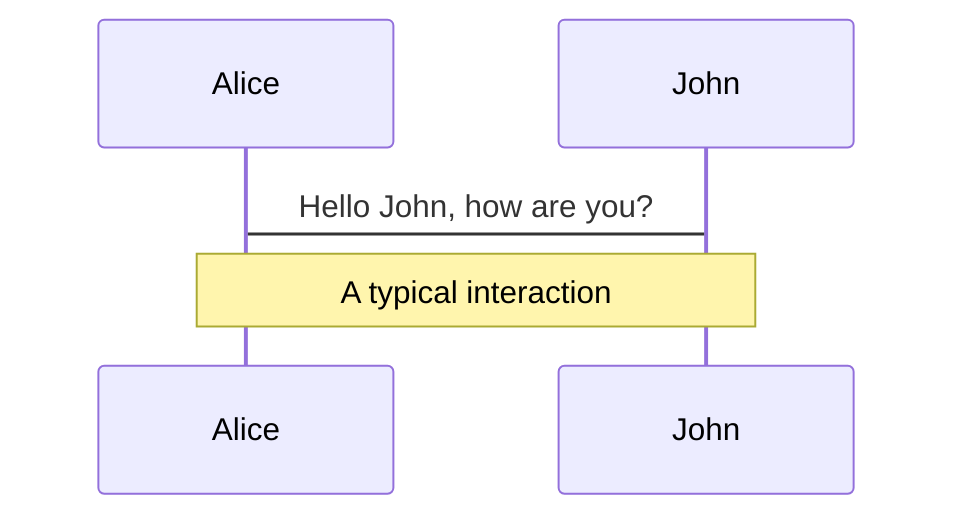
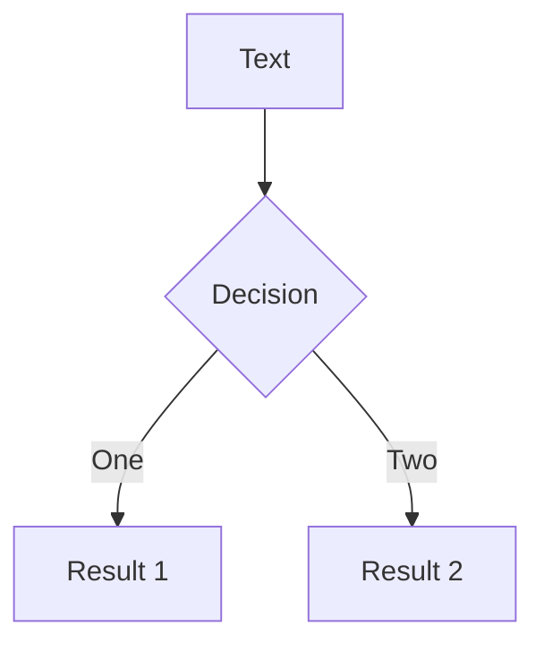
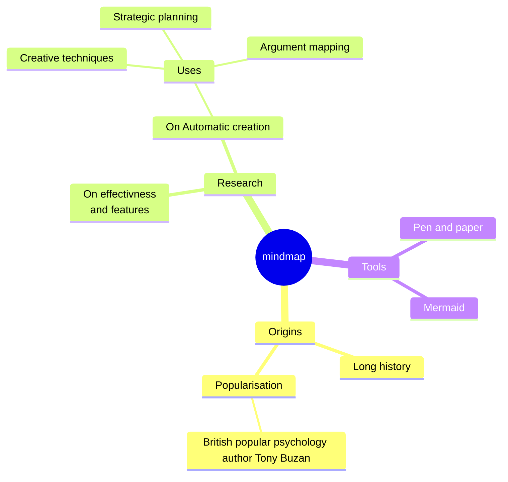
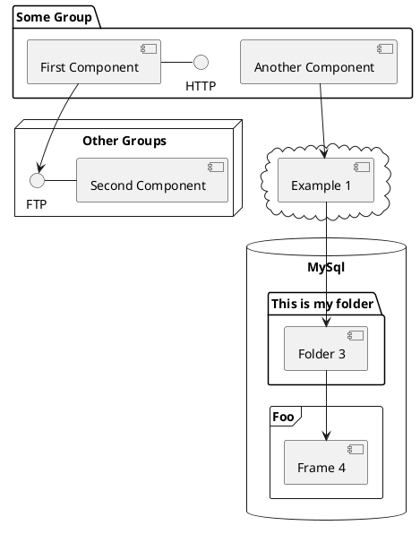

# Web CliMA dashboards 

Alexandre A. Renchon

<div class="pt-12">
  <span @click="$slidev.nav.next" class="px-2 py-1 rounded cursor-pointer" hover="bg-white bg-opacity-10">
    Press Space for next page <carbon:arrow-right class="inline"/>
  </span>
</div>

<div class="abs-br m-6 flex gap-2">
  <button @click="$slidev.nav.openInEditor()" title="Open in Editor" class="text-xl slidev-icon-btn opacity-50 !border-none !hover:text-white">
    <carbon:edit />
  </button>
  <a href="https://github.com/slidevjs/slidev" target="_blank" alt="GitHub"
    class="text-xl slidev-icon-btn opacity-50 !border-none !hover:text-white">
    <carbon-logo-github />
  </a>
</div>

<!--
The last comment block of each slide will be treated as slide notes. It will be visible and editable in Presenter Mode along with the slide. [Read more in the docs](https://sli.dev/guide/syntax.html#notes)
-->

---
layout: iframe
url: https://clima.github.io/ClimaLSM.jl/previews/PR214/dynamicdocs/pages/vegetation/farquhar_model/
scale: 0.6 
---

---

# How?

- Julia server on a virtual machine
- ClimaLSM.jl + WGLMakie.jl + JSServe.jl (!! I am the only one doing this - no mature library)
- Anything a Julia session can do

---

# Why?

- 100s of LSM models available... all inaccessible & bad documentation
- Making parts of CliMA accessible: 
	- No need to know Julia or even programming
	- Communication: teaching, scientists, funders, public...
	- Debugging, etc...
<br>
<br>
- Tapio critics - please do add to this list!:
	- **Why not notebook?** - still need to install and run cells
	- **Why not Python or other mature library?** - Dynamically runs Julia modules!
	- **"Everyone wants to make cool viz"** - Are there any LSM web dashboard? HYDRUS...
	- **Nobody uses it** - Anyone reading the docs will use it. FLUXNET PI and student will.

---
layout: iframe-right
url: https://simondanisch.github.io/JSServe.jl/stable/
scale: 0.6
---

# Why? JSServe docs

- Tapio critics - comments welcome! 
	- CliMA dashboard, but not used
	- !! Need to think of usage ahead of time
	- !! Need to think of deployment (where to host)

---
layout: iframe-right
url: https://cupoftea.earth/menu2/
scale: 0.6 
---

# More to come...

- ParamViz in ClimaLSM.jl docs (need to merge)
- Running ClimaLSM.jl at single site
- ClimaLSM.jl parameterisation fitted to databases
- ideas?

---
layout: image
image: ./images/ClimaLSM_dashboard.png
---

---

# How to make the server (in short!)
- Microsoft Azure, Ubuntu VM - $80/month
- ssh to your VM, e.g., `ssh -i ~/alexis-vm.pem arenchon@20.150.149.135`
- install NGINX (web server) `sudo apt install nginx`
- https certificate: Let's Encrypt, https://certbot.eff.org/
- configure /etc/nginx/sites-available/default.conf (code snippet next slide)
- install julia, your dependencies, GitHub...
- start server with JSServe (code snippet next slides) `screen` useful to keep running 

---

# Configure NGINX dynamic web server

```
server {
        root /var/www/html;       
        index index.html index.htm index.nginx-debian.html;
        server_name clima.westus3.cloudapp.azure.com; # managed by Certbot
        location / {
                try_files $uri $uri/ =404;
        }
		
		listen [::]:443 ssl ipv6only=on; # managed by Certbot
		listen 443 ssl; # managed by Certbot
		ssl_certificate /etc/letsencrypt/live/clima.westus3.cloudapp.azure.com/fullchain.pem; # managed by Certbot
		ssl_certificate_key /etc/letsencrypt/live/clima.westus3.cloudapp.azure.com/privkey.pem; # managed by Certbot
		include /etc/letsencrypt/options-ssl-nginx.conf; # managed by Certbot
		ssl_dhparam /etc/letsencrypt/ssl-dhparams.pem; # managed by Certbot

		location /jsserve/ {
			proxy_pass http://localhost:9385/;
			proxy_http_version 1.1;
			proxy_set_header Upgrade $http_upgrade;
			proxy_set_header Connection "Upgrade";
			proxy_set_header Host $host;
		}
}
```

---

# Start JSServe

```julia
using ParamViz, JSServe, ClimaLSM, ClimaLSM.Canopy, ClimaLSM.Soil.Biogeochemistry
FT = Float64

# Create server
IP = "127.0.0.1"
port = 9385
server = Server(IP, port; proxy_url="https://clima.westus3.cloudapp.azure.com/jsserve/")

# Load and create apps
include("leaf_An.jl"); An_app = An_app_f()
include("Beer.jl"); beer_app = Beer_app_f()
include("hetero_resp.jl"); Rh_app = Rh_app_f()
include("leaf_An_ci.jl"); An_ci_app = An_ci_app()

# Route apps
route!(server,"/leaf_An"=>An_app)
route!(server,"/beer_APAR"=>beer_app)
route!(server,"/leaf_An_ci"=>An_ci_app)
route!(server,"/Rh"=>Rh_app)
```

---

# Make an app with ParamViz and ClimaLSM

```julia
using ParamViz, ClimaLSM, ClimaLSM.Canopy
using Unitful: m, s, mol, μmol
FT = Float64
drivers = Drivers(("PAR (μmol m⁻² s⁻¹)", "LAI (m² m⁻²)"),
                         (FT.([0, 1500 * 1e-6]), FT.([0, 10])),
                         ((mol*m^-2*s^-1, μmol*m^-2*s^-1), (m^2*m^-2, m^2*m^-2))
                        )
parameters = Parameters(("canopy reflectance, ρ_leaf",
                         "extinction coefficient, K",
                         "clumping index, Ω"),
                         (FT.([0, 1]), FT.([0, 1]), FT.([0, 1])),
                         ((m, m), (m, m), (m, m)) # dummy units, no conversion
                        )
constants = Constants(("a", "b"), (FT(1), FT(2))) # dummy constants
inputs = Inputs(drivers, parameters, constants)
output = Output("APAR (μmol m⁻² s⁻¹)", [0, 1500 * 1e-6], (mol*m^-2*s^-1, μmol*m^-2*s^-1))
import ParamViz.parameterisation
function parameterisation(PAR, LAI, ρ_leaf, K, Ω, a, b)   
         APAR = plant_absorbed_ppfd(PAR, ρ_leaf, K, LAI, Ω) 
         return APAR
       end
webapp(parameterisation, inputs, output)
```

---

# What's next?
- The more we invest the more we get... (time x people)
- ClimaDashboard.jl
	- Atmosphere & Ocean
	- Apparent emergent properties in databases vs. CliMA
	- CI & versioning
	
---

# What is Slidev?

Slidev is a slides maker and presenter designed for developers, consist of the following features

- 📝 **Text-based** - focus on the content with Markdown, and then style them later
- 🎨 **Themable** - theme can be shared and used with npm packages
- 🧑‍💻 **Developer Friendly** - code highlighting, live coding with autocompletion
- 🤹 **Interactive** - embedding Vue components to enhance your expressions
- 🎥 **Recording** - built-in recording and camera view
- 📤 **Portable** - export into PDF, PNGs, or even a hostable SPA
- 🛠 **Hackable** - anything possible on a webpage

<br>
<br>

Read more about [Why Slidev?](https://sli.dev/guide/why)

<!--
You can have `style` tag in markdown to override the style for the current page.
Learn more: https://sli.dev/guide/syntax#embedded-styles
-->

<style>
h1 {
  background-color: #2B90B6;
  background-image: linear-gradient(45deg, #4EC5D4 10%, #146b8c 20%);
  background-size: 100%;
  -webkit-background-clip: text;
  -moz-background-clip: text;
  -webkit-text-fill-color: transparent;
  -moz-text-fill-color: transparent;
}
</style>

<!--
Here is another comment.
-->

---
layout: default
---

# Table of contents

```
<Toc minDepth="1" maxDepth="5"></Toc>
```

<Toc></Toc>

---
transition: slide-up

level: 2
---

# Navigation

Hover on the bottom-left corner to see the navigation's controls panel, [learn more](https://sli.dev/guide/navigation.html)

### Keyboard Shortcuts

|     |     |
| --- | --- |
| <kbd>right</kbd> / <kbd>space</kbd>| next animation or slide |
| <kbd>left</kbd>  / <kbd>shift</kbd><kbd>space</kbd> | previous animation or slide |
| <kbd>up</kbd> | previous slide |
| <kbd>down</kbd> | next slide |

<!-- https://sli.dev/guide/animations.html#click-animations -->

<p v-after class="absolute bottom-23 left-45 opacity-30 transform -rotate-10">Here!</p>

---
layout: image-right
image: https://source.unsplash.com/collection/94734566/1920x1080
---

# Code

Use code snippets and get the highlighting directly![^1]

```ts {all|2|1-6|9|all}
interface User {
  id: number
  firstName: string
  lastName: string
  role: string
}

function updateUser(id: number, update: User) {
  const user = getUser(id)
  const newUser = { ...user, ...update }
  saveUser(id, newUser)
}
```

<arrow v-click="3" x1="400" y1="420" x2="230" y2="330" color="#564" width="3" arrowSize="1" />

[^1]: [Learn More](https://sli.dev/guide/syntax.html#line-highlighting)

<style>
.footnotes-sep {
  @apply mt-20 opacity-10;
}
.footnotes {
  @apply text-sm opacity-75;
}
.footnote-backref {
  display: none;
}
</style>

---

# Components

<div grid="~ cols-2 gap-4">
<div>

You can use Vue components directly inside your slides.

We have provided a few built-in components like `<Tweet/>` and `<Youtube/>` that you can use directly. And adding your custom components is also super easy.

```html
<Counter :count="10" />
```

<!-- ./components/Counter.vue -->
<Counter :count="10" m="t-4" />

Check out [the guides](https://sli.dev/builtin/components.html) for more.

</div>
<div>

```html
<Tweet id="1390115482657726468" />
```

<Tweet id="1390115482657726468" scale="0.65" />

</div>
</div>

<!--
Presenter note with **bold**, *italic*, and ~~striked~~ text.

Also, HTML elements are valid:
<div class="flex w-full">
  <span style="flex-grow: 1;">Left content</span>
  <span>Right content</span>
</div>
-->


---
class: px-20
---

# Themes

Slidev comes with powerful theming support. Themes can provide styles, layouts, components, or even configurations for tools. Switching between themes by just **one edit** in your frontmatter:

<div grid="~ cols-2 gap-2" m="-t-2">

```yaml
---
theme: default
---
```

```yaml
---
theme: seriph
---
```


</div>

Read more about [How to use a theme](https://sli.dev/themes/use.html) and
check out the [Awesome Themes Gallery](https://sli.dev/themes/gallery.html).

---
preload: false
---

# Animations

Animations are powered by [@vueuse/motion](https://motion.vueuse.org/).

```html
<div
  v-motion
  :initial="{ x: -80 }"
  :enter="{ x: 0 }">
  Slidev
</div>
```

<div class="w-60 relative mt-6">
  <div class="relative w-40 h-40">
    
    
    
  </div>

  <div
    class="text-5xl absolute top-14 left-40 text-[#2B90B6] -z-1"
    v-motion
    :initial="{ x: -80, opacity: 0}"
    :enter="{ x: 0, opacity: 1, transition: { delay: 2000, duration: 1000 } }">
    Slidev
  </div>
</div>

<!-- vue script setup scripts can be directly used in markdown, and will only affects current page -->
<script setup lang="ts">
const final = {
  x: 0,
  y: 0,
  rotate: 0,
  scale: 1,
  transition: {
    type: 'spring',
    damping: 10,
    stiffness: 20,
    mass: 2
  }
}
</script>

<div
  v-motion
  :initial="{ x:35, y: 40, opacity: 0}"
  :enter="{ y: 0, opacity: 1, transition: { delay: 3500 } }">

[Learn More](https://sli.dev/guide/animations.html#motion)

</div>

---

# LaTeX

LaTeX is supported out-of-box powered by [KaTeX](https://katex.org/).

<br>

Inline $\sqrt{3x-1}+(1+x)^2$

Block
$$
\begin{array}{c}

\nabla \times \vec{\mathbf{B}} -\, \frac1c\, \frac{\partial\vec{\mathbf{E}}}{\partial t} &
= \frac{4\pi}{c}\vec{\mathbf{j}}    \nabla \cdot \vec{\mathbf{E}} & = 4 \pi \rho \\

\nabla \times \vec{\mathbf{E}}\, +\, \frac1c\, \frac{\partial\vec{\mathbf{B}}}{\partial t} & = \vec{\mathbf{0}} \\

\nabla \cdot \vec{\mathbf{B}} & = 0

\end{array}
$$

<br>

[Learn more](https://sli.dev/guide/syntax#latex)

---

# Diagrams

You can create diagrams / graphs from textual descriptions, directly in your Markdown.

<div class="grid grid-cols-4 gap-5 pt-4 -mb-6">









</div>

[Learn More](https://sli.dev/guide/syntax.html#diagrams)

---
src: ./pages/multiple-entries.md
hide: false
---

---
layout: center
class: text-center
---

# Learn More

[Documentations](https://sli.dev) · [GitHub](https://github.com/slidevjs/slidev) · [Showcases](https://sli.dev/showcases.html)
